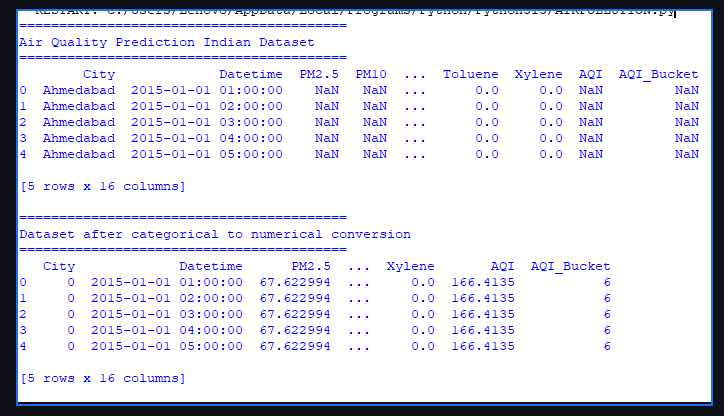
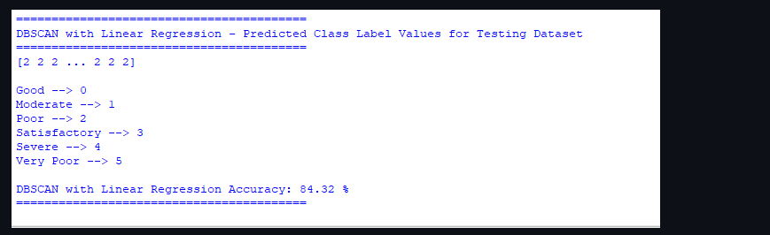
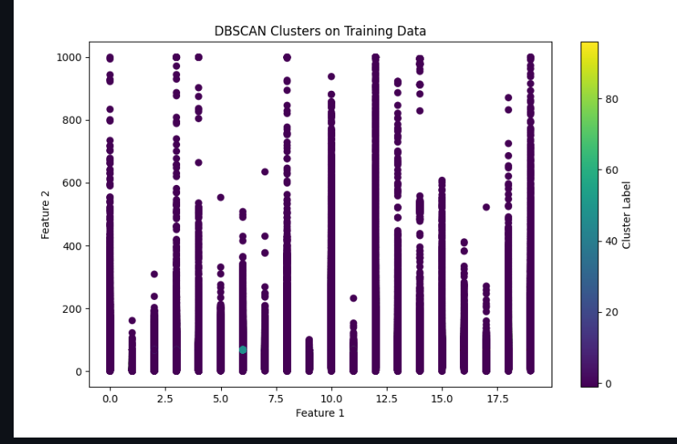
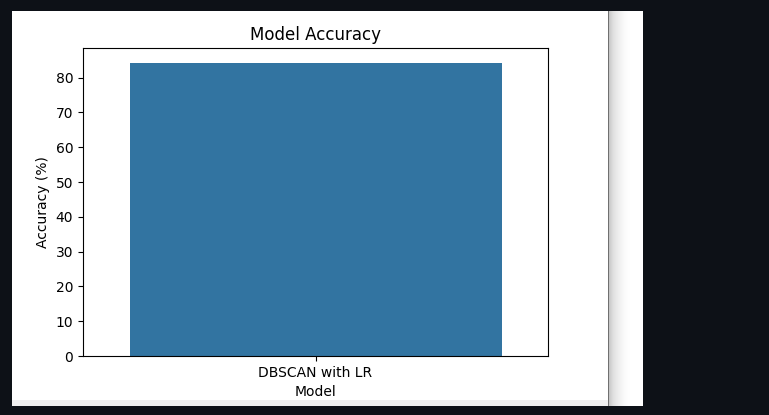
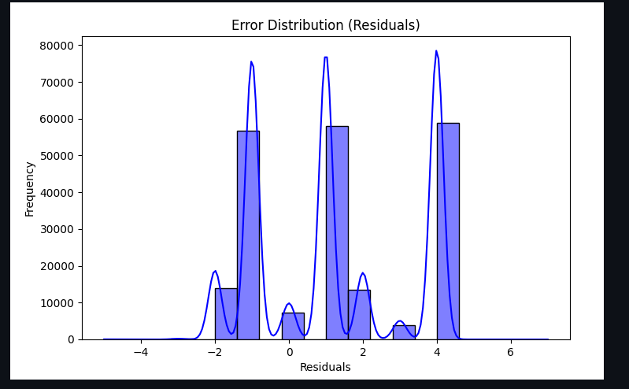
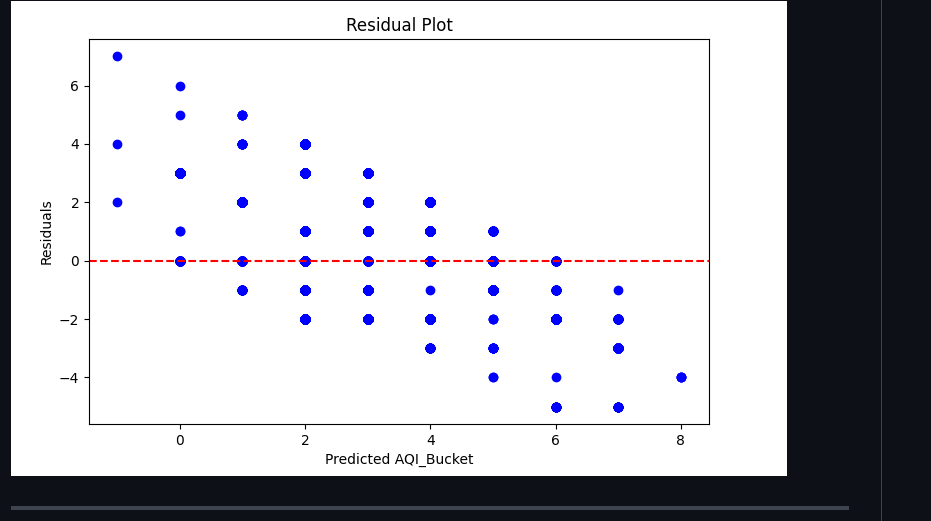

# 🌍 Air Pollution Monitoring Using DBSCAN Algorithm

## 📌 Project Overview

Air pollution has become one of the most critical environmental challenges affecting public health and quality of life worldwide. This project presents an intelligent **Air Pollution Monitoring System** that utilizes the **DBSCAN (Density-Based Spatial Clustering of Applications with Noise)** algorithm to analyze, monitor, and predict air quality patterns across various cities.

The system processes air quality data, identifies pollution clusters, detects anomalies, and categorizes regions based on pollution severity. By leveraging machine learning and data visualization techniques, the project helps environmental researchers, policymakers, and the public better understand pollution trends and take informed actions.

---

## 🎯 Objectives

* Monitor air pollution levels across multiple cities.
* Analyze pollutant concentrations and air quality trends.
* Identify highly polluted regions using clustering techniques.
* Detect abnormal pollution patterns and outliers.
* Evaluate prediction performance using accuracy metrics.
* Provide visual insights through interactive graphs and plots.

---

## 🚀 Key Features

### 📊 Air Quality Analysis

* Processes air quality datasets containing multiple pollutants.
* Analyzes pollution levels across different regions and cities.
* Provides meaningful insights into environmental conditions.

### 🔍 DBSCAN-Based Clustering

* Groups locations with similar pollution characteristics.
* Automatically discovers clusters without requiring a predefined number of clusters.
* Supports identification of irregularly shaped pollution regions.

### 🚨 Outlier and Noise Detection

* Detects abnormal pollution readings.
* Identifies regions with unusual environmental conditions.
* Improves the reliability of air quality analysis.

### 📈 Visualization and Reporting

* Generates informative visualizations for pollution analysis.
* Displays clustering results and pollution distributions.
* Supports trend analysis through graphs and charts.

### 📏 Performance Evaluation

* Compares predicted pollution patterns with actual observations.
* Calculates model accuracy and evaluation metrics.
* Helps assess clustering effectiveness.

---

## 🛠️ Technologies Used

### Programming Language

* **Python**

### Libraries and Frameworks

| Library      | Purpose                             |
| ------------ | ----------------------------------- |
| Scikit-Learn | Implementation of DBSCAN clustering |
| Pandas       | Data cleaning and preprocessing     |
| NumPy        | Numerical computations              |
| Matplotlib   | Data visualization                  |
| Seaborn      | Statistical graphics and plotting   |

---

## 🗂️ Dataset Information

The project uses the **Air Quality Data in India** dataset, which contains pollution measurements collected from multiple cities.

### Dataset Features

* City Name
* PM2.5 (Fine Particulate Matter)
* PM10 (Particulate Matter)
* NO₂ (Nitrogen Dioxide)
* CO (Carbon Monoxide)
* SO₂ (Sulfur Dioxide)
* O₃ (Ozone)
* Air Quality Index (AQI)

### Dataset Source

🔗 Dataset Link:

https://www.kaggle.com/datasets/rohanrao/air-quality-data-in-india

---

## 🧠 About DBSCAN Algorithm

DBSCAN (Density-Based Spatial Clustering of Applications with Noise) is an unsupervised machine learning algorithm used for clustering data points based on density.

Unlike traditional clustering algorithms such as K-Means, DBSCAN:

* Does not require specifying the number of clusters beforehand.
* Can detect clusters of arbitrary shapes.
* Effectively identifies noise and outliers.

### Core Concepts

#### Core Points

Points having at least **MinPts** neighbors within a specified radius **ε (epsilon)**.

#### Border Points

Points that are reachable from a core point but do not contain enough neighbors to become core points themselves.

#### Noise Points

Points that do not belong to any cluster and are considered outliers.

### Important Parameters

#### ε (Epsilon)

Defines the neighborhood radius around each point.

#### MinPts

Minimum number of neighboring points required to form a dense region.

---

## ⚙️ Project Workflow

### Step 1: Data Collection

* Load air quality dataset.
* Extract pollutant measurements.

### Step 2: Data Preprocessing

* Handle missing values.
* Clean and normalize data.
* Select relevant pollution features.

### Step 3: Feature Analysis

* Analyze pollutant distributions.
* Study correlations between pollutants.

### Step 4: DBSCAN Clustering

* Apply DBSCAN algorithm.
* Generate pollution clusters.
* Detect noise points.

### Step 5: Visualization

* Plot cluster distributions.
* Visualize pollution patterns.
* Generate performance charts.

### Step 6: Evaluation

* Assess clustering effectiveness.
* Analyze detected pollution regions.
* Calculate prediction accuracy.

---

## 📸 Project Screenshots









---

## 📂 Project Structure

```text
Air-Pollution-Monitoring-Using-DBSCAN/
│
├── dataset/
│   └── air_quality_data.csv
│
├── screenshots/
│   ├── AQI.PNG
│   ├── dbscan.PNG
│   ├── db cluster.PNG
│   ├── dblr.PNG
│   ├── residual.PNG
│   └── aqibuck.PNG
│
├── src/
│   ├── preprocessing.py
│   ├── dbscan_model.py
│   ├── visualization.py
│   └── evaluation.py
│
├── requirements.txt
├── README.md
└── main.py
```

---

## ▶️ Installation and Setup

### Clone the Repository

```bash
git clone https://github.com/yourusername/Air-Pollution-Monitoring-Using-DBSCAN.git
```

### Navigate to Project Directory

```bash
cd Air-Pollution-Monitoring-Using-DBSCAN
```

### Install Required Libraries

```bash
pip install -r requirements.txt
```

### Run the Project

```bash
python main.py
```

---

## 📊 Results

The DBSCAN model successfully:

* Identified pollution clusters across cities.
* Detected abnormal pollution regions.
* Segmented areas based on air quality levels.
* Visualized pollution trends effectively.
* Assisted in understanding environmental pollution patterns.

---

## 🌱 Social and Environmental Impact

This project contributes to:

* Environmental monitoring and sustainability.
* Public awareness regarding air pollution.
* Data-driven environmental decision-making.
* Identification of high-risk pollution zones.
* Future smart-city air quality management systems.

---

## 🔮 Future Enhancements

* Integration with real-time IoT air quality sensors.
* Live pollution monitoring dashboard.
* Interactive web-based visualization.
* Advanced machine learning prediction models.
* Global air quality monitoring support.
* Deployment using cloud platforms.

---

## 📚 References

### DBSCAN Learning Resource

**Clustering Like a Pro: A Beginner's Guide to DBSCAN**

https://medium.com/@sachinsoni600517/clustering-like-a-pro-a-beginners-guide-to-dbscan-6c8274c362c4

### Dataset Reference

Air Quality Data in India Dataset

https://www.kaggle.com/datasets/rohanrao/air-quality-data-in-india

---

## 👨‍💻 Author

**Athira Mohan**

* B.E. Computer Science and Engineering
* Python Developer
* Data Analytics Enthusiast
* Machine Learning Learner

---

## ⭐ Support

If you found this project useful, consider giving it a ⭐ on GitHub. Your support helps improve and expand future environmental monitoring projects.
